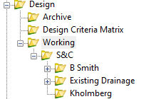

# 3D File Setup in OpenRoads Designer
{: .no_toc }

## Table of contents
{: .no_toc .text-delta }

1. TOC
{:toc}

---

This document will guide you through the proper set up of 3D Project files. Proper setup is essential to data management and a project's
future success.

3D files should only be used for **modeling**. For S&C, this will primarily for drainage modeling. We don't model utility or SWPPP files.

## Creating 3D drainage design files

1.  Navigate to the project in ITD ProjectWise.

    -   The project is usually located in **PWITD** > **Documents** > **District** or **HDR_US_West_01**. You'll be given the appropriate file path and name at the start of the project.

2.  Find the project-specific [seed] file, usually located in the **Design** folder or in the **Project Resources** folder.

    -   The seed files, created by the [prime], contain coordinate information. Using this file creates a standard across the project and eliminates any errors in file set up. [ITD] standard line styles, text, and cell libraries will be imported by using the prime's seed file **Always use the Seed files created by the prime.**

3.  Right click on the 3D seed file.

4.  Select **Copy**.

5.  Paste the file into the Design folder.

6.  Select **No Wizard** in the pop-up window and continue.

7.  Rename the pasted file to the appropriate convention.

    -   Typical naming convention for a 3D Drainage file: `20442_DRAIN_S02.dgn`

        -   The letter delineator, here "S", is set by the prime, typically in a CAD Tech memo. This is to show which firm has ownership of each file. S&C typically uses "S" as its delineator. If "S" is unavailable, we default to "C".

8. Add a description (e.g., 3D Drainage Modeling)

9.  Open the renamed file

10.  Attach any pertinent reference files. See [Tips & Tricks] for information on referencing. Make sure all references are attached using **Coincident World**.
- Typical references for all files:
    -   Topo
    -   Existing Surface
    -   Proposed Surface (often not available in early stages of a project)
    -   Aerial Imagery
    -   Design Files
    -   Alignment

10.   Click **Fit View** in the View menu bar.

11. Close the file.

## Creating working drainage design files

Working files are not yet ready to be available for others to reference
or view.

1.  Navigate to the project in ITD ProjectWise.

2.  Navigate to Design > Working > S&C >*Your Working Folder*

    -   If a working directory does not yet exist, create it.
        -   To create a new folder in ProjectWise, in the menu bar, click **Folder** > **New Folder**

    -   Add a folder with your first initial and last name:

    

3.  Find the project-specific [seed] file, usually located in the Design folder or in the Project Resources folder.

    -   The seed files, created by the [prime], contain coordinate information. Using this file creates a standard across the project and eliminates any errors in file set up. [ITD] standard line styles, text, and cell libraries will be imported by the prime's seed file **Always use the Seed files created by the prime.**

4.  Right click on the 3D seed file.

5.  Select **Copy**.

6.  Paste the file into your working Design folder.

7.  Rename the pasted file to the appropriate convention with `_Working.dgn`
    at the end.

    -   Typical naming convention for a 3D Drainage file: `20442_DRAIN_S02_Working.dgn`
        -   The letter delineator, here "S", is set by the prime, typically in a CAD Tech memo. This is to show which firm has ownership of each file. S&C typically uses "S" as its delineator. If "S" is unavailable, we default to "C".

8.  Open the renamed file.

9.  Attach any pertinent references.

    -   Typical references for all files:

        -   Topo
        -   Existing Surface
        -   Proposed Surface (often not available in early stages of a project)
        -   Aerial Imagery

10. When you are ready to move the file to the Design folder for others to use and reference, remove `_Working` from the end. Right click on the file, select **Cut**, and **Paste** it into the Design folder.

## Archiving files

Once you are done with a file, move it to **Design** > **Working** > **S&C** > **Archive**. This will help with data management. Never delete files, always archive them. If an Archive folder doesn't exist yet, create one.

[Tips & Tricks]: /docs/tips-and-tricks
[seed]: /docs/glossary#seed-file
[prime]: /docs/glossary#prime
[ITD]: /docs/glossary#itd