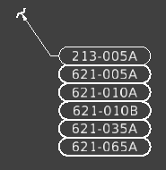
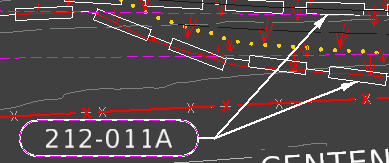

# Annotating Sheets
{: .no_toc }

## Table of contents
{: .no_toc .text-delta }

1. TOC
{:toc}

---

After you've [added BMPs to the Design] file, you need to annotate your plan sheets with bubble call outs. Bubble call outs point out BMP locations on plan sheets to help on-site contractors understand where to place which BMPs. 

## Adding Bubble Call Outs
***

1. Find the bubble call outs in the [boneyard].

    - Boneyard bubble call outs can only be copied, they can't be moved.

2. Verify the bid item numbers are correct in the call outs. 

    - The number in the bubble call out corresponds to a BMP's bid item number. For example, 212-095A is an inlet protection BMP, while 212-011A is for wattles. For seeding shapes, you'll need to use the call out with six stacked bubbles:

    

    - If a call out's bid item number is incorrect, fix it in the [border file]. 

3. Copy the bubble call out. 

    - Make sure to also copy the arrow and, for seeding call outs, the tilde symbol at the end of the arrow.

4. Place the bubble call out somewhere near the BMP you want to point out.

    - Try to put the bubble somewhere where it doesn't obstruct any other annotations or design. Over surface contour lines is OK, however. 

    - If you have to place the bubble somewhere with a lot of other annotations, [clip mask] is to make it more prominent.

5. Make the end of the arrow touch the BMP you want to point out.

    - For seeding bubbles, place the tilde (~) in the seeding shape, then point the arrow to the center of the tilde. [Rotate] the tilde so it's more or less perpendicular to the arrow.

6. If you have multiples of the same BMPs near each other, you can paste multiple bubble call outs on top of each other and point the arrows to the various BMPs:

    - Be sure to delete the overlapping bubble call outs, as they'll show up darker in the printed version of the sheet. 

7. Follow the above steps, making sure that every BMP shape, line, or symbol on the sheet has a call out. Annotate all the sheets in your project.

8. [Print] a PDF copy of your plan sheets and verify everything looks right. If so, send to the project's PM for review.

9. Once you've addressed the PM's comments, you can begin pulling [quantities].

[added BMPs to the Design]: /knowledge-base/docs/design-in-ord
[boneyard]: /knowledge-base/docs/glossary#boneyard
[border file]: /knowledge-base/docs/glossary#border-file
[clip mask]: /knowledge-base/docs/ord-tips#clip-mask
[Rotate]: /knowledge-base/docs/ord-tips#rotating-elements
[Print]: /knowledge-base/docs/sheet-printing
[quantities]: /knowledge-base/docs/quantities