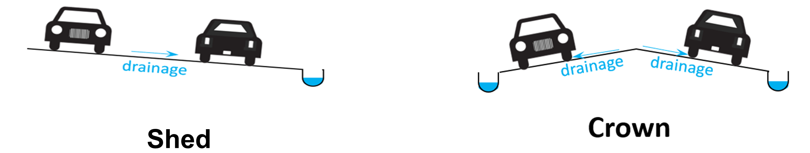
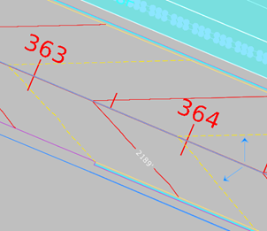
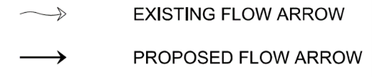
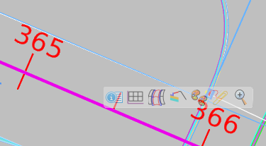
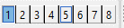
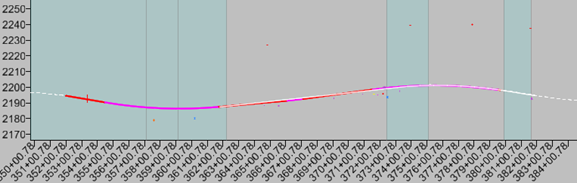

# Stormwater Basin Delineation in ORD
{: .no_toc }

## Table of contents
{: .no_toc .text-delta }

1. TOC
{:toc}

---

This page outlines how to create urban storm water basin delineations in ORD. Basin delineation should happen in the 2D design file.

For our purposes, a basin is an area where water collects and flows towards a central point or lower elevation. Basin delineation is the process of marking basin boundaries within a project's scope. The purpose is to determine where and how much water is flowing to a location in order to set inlets, size [swales], and begin the drainage design.

## Proposed Basin Delineation
***

1.  Open the 2D Design file.

2.  Display the proposed terrain file level. See the [Tips & Tricks](/docs/ord-tips#how-to-display-a-level) page for more information on levels.

3.  Display the proposed alignment (`ALG` or `ALGN`) file level.

4.  Identify if the road is a crown or shed section by looking at the contour lines in ORD and the typical section PDF file provided by the [prime].

    -   Contour lines are usually in the proposed terrain file, but can sometimes be in the corridor files.

    
    {: .ml-5 }

5.  Using the proposed surface (proposed terrain + proposed alignment = proposed surface), draw proposed drainage arrows throughout the project. See the [Tips & Tricks](/docs/ord-tips#placing-a-new-arrow) for how to draw an arrow.

    -   Water flows perpendicular to the contour lines. In the illustration below, the contour lines are the red and yellow lines.

    
    {: .ml-5 }

    - Proposed arrows should go on the `HYDR_BASIN_Flowpath-Proposed` level as straight arrows.

    - Existing arrows should go on the `HYDR_BASIN_Flowpath-Existing` level as wavy arrows.

    

6.  Click on the [alignment line] and hover over it.

    
    {: .ml-2 }

7.  Select the Open Profile Model icon

    - Open the profile model in another view port, either 5 or 6, on the bottom of the screen:

    
    {: .ml-5 }

8.  Identify high points and low points along the alignment.

    -   Write down the station number (x-axis on the bottom) at the high points and the low points somewhere else.

    
    {: .ml-5 }

9.  Return to the Plan view by clicking the close button, then set your active level to `HYDR_BASIN_Flowpath-Proposed`.

10. Draw the identified high point and low points in the plan view using the **Place Line** tool.

11. Draw the proposed [impervious] drainage basin based on the proposed surface, identified high points and low points, and typical sections.

    -   Keep impervious and pervious basins separate. This will make it easier to calculate areas for the basins.

    -   Put the impervious and pervious basins on different levels. See [Tips & Tricks](/docs/ord-tips#how-to-create-a-new-level) for how to create new levels.

    -   Follow the naming conventions for the new level and add `PERV` or `IMPERV`.

    -   Notice that SH4 is a shed section based on the arrows. Sh5 and SH6 are crown sections. So three basins will have been delineated.

    
    {: .ml-5 }

12. Identify the [pervious] drainage areas and create complex shapes

    -   The Complex Shapes tool is located at **Drawing** > **Groups** > **Complex Shapes**

    -   Only draw shapes up to the [ROW (right-of-way) line] unless instructed otherwise. Attach the ROW reference file to make sure you are staying within the ROW.

    -   Make sure to use the Complex Shape tool to make the basins a shape, rather than a bunch of lines. This will let you to get the accurate area measurement of the shape.

13. Create a new, separate level, called something like `ANNO_Pervious_Areas` or `ANNO_Impervious_Areas`.

14. On this new level, annotate the areas of each basin for the Principal Engineer.

    -   When you create the new level, turn off **Print** for both `ANNO` levels.

    -   Use the **Place Text** tool to record the area.

    -   Use a naming convention like `SH4_IP=100sq ft` or `SH4_P=100sq ft`. (SH4 = the basin name, IP/P = impervious/ pervious, then the measured area for the shape).

## Existing Drainage Basin Delineation
***

1.  Follow all the steps above, but use the existing terrain file level, rather than the proposed surface file level.

2.  Place all delineations on existing conditions levels such as `HYDR_Flowpath_Existing` or `HYDR_Drainage_Basin-Existing`

[Tips & Tricks]: /docs/tips-and-tricks
[swales]: /docs/glossary#swale
[pervious]: /docs/glossary#pervious-drainage-basin
[impervious]: /docs/glossary#impervious-drainage-basin
[alignment line]: /docs/glossary#alignment-line
[ROW (right-of-way) line]: /docs/glossary#row-line