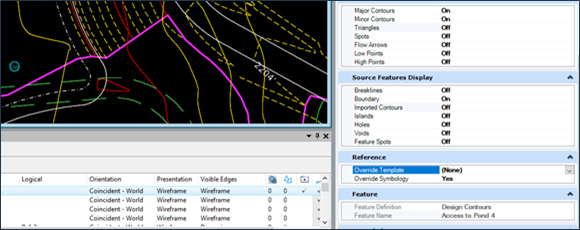
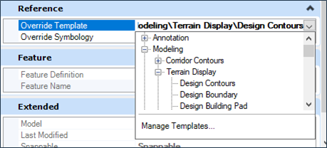
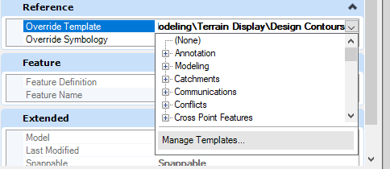
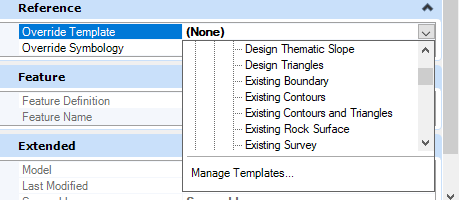

# Displaying Surface Contours in ORD
{: .no_toc }

## Table of contents
{: .no_toc .text-delta }

1. TOC
{:toc}

---

This page explains how to display [contours] in terrain files which are typically provided by the prime.

## For Proposed Contours
***

1.  Use the Element Selection tool to click on a terrain model boundary or contour. 

    -   Once selected, the boundary will appear highlighted.

2.  Click the Properties icon to display the **Properties** pane.

3.  In the Reference section, change Override Symbology to **Yes**.

    -   When you select Yes, the Override template will display.

    
    {: .ml-5 }

4.  From the Override Template drop-down menu, select **Modeling** > **Terrain Display** > **Design Contours**.

    
    {: .ml-5 }

5.  Select the same drop-down again and click **Manage Templates...**

    
    {: .ml-5 }

6.  Navigate to **Modeling** > **Terrain Display** > **Design Contours**.

    -   Change the settings to whatever you need. 

7.  Set the Override Symbology to **Yes** for each terrain model.

8.  Set the Override Template to **Modeling** > **Terrain Display** > **Design Contours**

9.  The Contour lines should now display in the [design] file. 

## For Existing Contours
***

1.  Follow the same steps as above but set the Override Template in step 4 to **Modeling** > **Terrain Display** > **Existing Contours**.

-   Existing contours are displayed in grey.

{: .ml-5 }

## Troubleshooting
***

**Text display issues**

If there are issues with the way your text displays (elevation numbers), identify which style is being used and update it in Text Styles.The easiest way to access Text Styles is to use the Search bar at the top right of your screen.

[contours]: /knowledge-base/docs/glossary#contours
[design]: /knowledge-base/docs/glossary#design-file