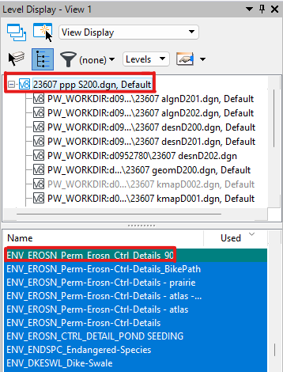
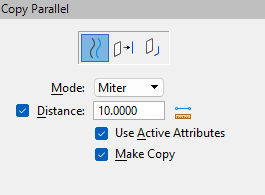
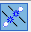
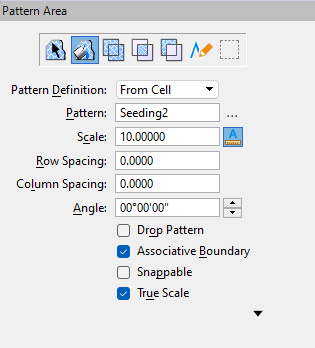

# SWPPP Design in ORD
{: .no_toc }

## Table of contents
{: .no_toc .text-delta }

1. TOC
{:toc}

---

SWPPP design in ORD has two phases: the first involves adding your SWPPP [BMPs] to the project's SWPPP design file. The second phase involves adding bubble labels (or call outs) and stationing quantities to the Plan Sheets. 

This page covers the first phase: adding your BMPs to the SWPPP design file. 

## Adding Seeding to the Design File
Seeding shapes show the on-site contractors where to place temporary seeding, permanent seeding, as well as fertilizers and topsoil. 

### Confirm the offset measurements with your PM

- The offset is usually measured from the Edge of Pavement and the [Top of Cut] or [Toe of Fill] lines.

- Make sure you have the appropriate levels turned on. Edge of Pavement will be named  something like `DES_ROADWAY_Edge_of_Pavement` and the Cut/ Fill lines will be `DES_ROADWAY_Top_of_Cut` and `DES_ROADWAY_Toe_of-Fill`. These levels will be located in the Prime's design file.

- Depending on the project, you may also need to turn on levels that display things like retaining walls and sidewalks.

### Create a [new level] for your seeding shapes

1. Navigate to the Level Display pane and select the topmost design file.
    
    - The topmost design file should be your SWPPP design file.

    
    {: .ml-2 }

2. Name your new level something like `ENV_EROSN_Perm_Erosn_Ctrl_[RAMP or ROAD name]` and set the level color to 3 (red).

    {: .note }
    It's helpful to name your level after the ramp or road that the seeding shape parallels, as you'll want to display the seeding shape on the correct level with the corresponding plan sheet (i.e., the plan sheets for **Ramp AB** should display the `ENV_EROSN_Perm_Erosn_Ctrl_RampAB` seeding shapes).

3. Set the new level to  [active].

### Create seeding shapes

1. Make sure you're on the correct level for your seeding shape.

2. Select **Move Parallel**, then set the properties to Element, Mode: Miter, Distance: \[offset distance\], Use Active Attributes, Make Copy:

    
    {: .ml-2 }

3. Make a parallel line along the Edge of Pavement and Top or Toe lines.

4. There may be places where there is a gap between the Top/ Toe lines. Use the Place Line tool to connect small gaps. Large gaps may need a line or may just be the end of an area that needs seeding.

5. Use the Break Element tool to "break" the seeding level line at the sheet cuts. Also break the lines of the sheet cuts where they meet the seeding lines.

    - Break by drag line lets you drag a line across your line to "break" it: 

6. Use the Create Complex Shape tool to make a shape out of your lines. The properties should be Method: Manual, Area: Solid, Fill Type: None.

7. Click each line you placed and the sections of sheet lines to make a shape. Once all the lines are highlighted, left click to confirm, then right click.

8. Take a little time to clean up your shape (move handles that are outside the shape back into it, make sure your shape is confined to within the sheet edges, etc.).

### Fill your shape with the seeding pattern

1. Use the Element Selection tool to select your shape.

2. Use the Pattern Area tool to fill your shape. Make sure your properties are set to:

    
    {: .ml-2 }

3. You can pattern around [interior shapes] if you need to.

[Top of Cut]: /knowledge-base/docs/glossary#top-of-cut
[Toe of Fill]: /knowledge-base/docs/glossary#toe-of-fill
[BMPs]: /knowledge-base/docs/glossary#bmp
[new level]: /knowledge-base/docs/ord-tips#how-to-create-a-new-level
[active]: /knowledge-base/docs/ord-tips#how-to-set-a-level-as-active
[interior shapes]: /knowledge-base/docs/ord-tips#adding-pattern-fill-around-an-interior-shape
