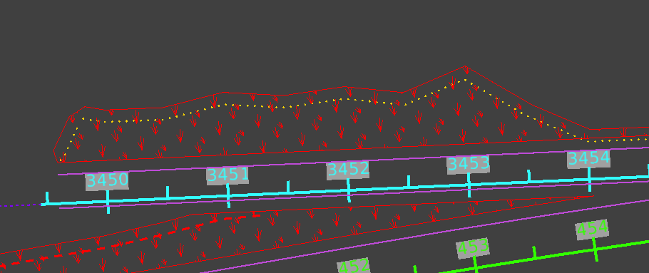
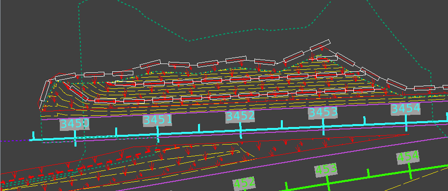
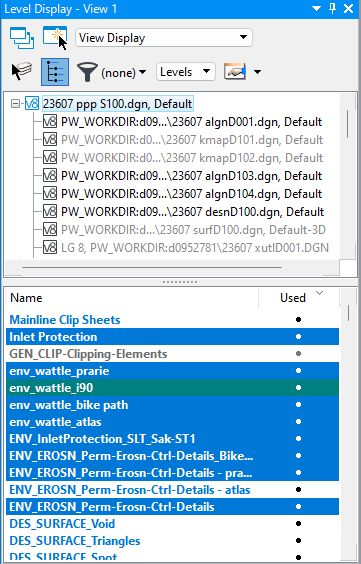
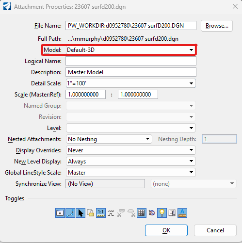
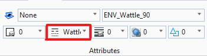
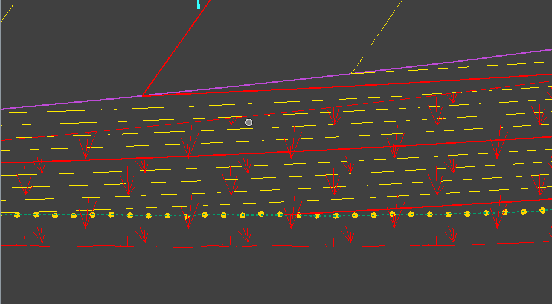
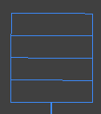
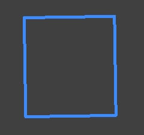
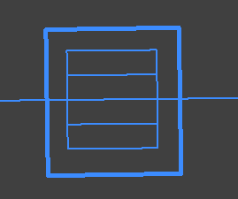

# SWPPP Design in ORD
{: .no_toc }

## Table of contents
{: .no_toc .text-delta }

1. TOC
{:toc}

---

SWPPP design in ORD has two phases: the first involves adding your SWPPP [BMPs] to the project's SWPPP design file. The second phase involves adding bubble labels (or call outs) and stationing quantities to the Plan Sheets. 

This page covers the first phase: adding your BMPs to the SWPPP design file. 

## Adding Seeding to the Design File
***
Seeding shapes show the on-site contractors where to place temporary seeding, permanent seeding, as well as fertilizers and topsoil. 

The final shapes will look something like this:

{: .ml-2 }

### Confirm the offset measurements with your PM
***

- The offset is usually measured from the Edge of Pavement and the [Top of Cut] or [Toe of Fill] lines.

- Make sure you have the appropriate levels turned on. Edge of Pavement will be named  something like `DES_ROADWAY_Edge_of_Pavement` and the Cut/ Fill lines will be `DES_ROADWAY_Top_of_Cut` and `DES_ROADWAY_Toe_of-Fill`. These levels will be located in the Prime's design file.

- Depending on the project, you may also need to turn on levels that display things like retaining walls and sidewalks.

### Create a [new level] for your seeding shapes
***

1. Navigate to the Level Display pane and select the topmost design file.
    
    - The topmost design file should be your SWPPP design file.

    
    {: .ml-2 }

2. Name your new level something like `ENV_EROSN_Perm_Erosn_Ctrl_[RAMP or ROAD name]` and set the level color to 3 (red).

    {: .note }
    It's helpful to name your level after the ramp or road that the seeding shape parallels, as you'll want to display the seeding shape on the correct level with the corresponding plan sheet (i.e., the plan sheets for **Ramp AB** should display the `ENV_EROSN_Perm_Erosn_Ctrl_RampAB` seeding shapes).

3. Set the new level to  [active].

### Create seeding shapes
***

1. Make sure you're on the correct level for your seeding shape.

2. Select **Move Parallel**, then set the properties to Element, Mode: Miter, Distance: \[offset distance\], Use Active Attributes, Make Copy:

    
    {: .ml-2 }

3. Make a parallel line along the Edge of Pavement and Top or Toe lines.

4. There may be places where there is a gap between the Top/ Toe lines. Use the Place Line tool to connect small gaps. Large gaps may need a line or may just be the end of an area that needs seeding.

5. Use the Break Element tool to "break" the seeding level line at the sheet cuts. Also break the lines of the sheet cuts where they meet the seeding lines.

    - Break by drag line lets you drag a line across your line to "break" it: 

6. Use the Create Complex Shape tool to make a shape out of your lines. The properties should be Method: Manual, Area: Solid, Fill Type: None.

7. Click each line you placed and the sections of sheet lines to make a shape. Once all the lines are highlighted, left click to confirm, then right click.

8. Take a little time to clean up your shape (move handles that are outside the shape back into it, make sure your shape is confined to within the sheet edges, etc.).

### Fill your shape with the seeding pattern
***

1. Use the Element Selection tool to select your shape.

2. Use the Pattern Area tool to fill your shape. Make sure your properties are set to:

    
    {: .ml-2 }

3. You can pattern around [interior shapes] if you need to.

## Adding Wattles to the Design File
***

Wattle lines in ORD show where [wattles] should be places on seeding shapes. Wattles are placed along major contours on slopes that within seeding shapes and edges of seeding shapes that are along Toe of Fill lines. 

When you're done placing wattles, your design should look like:

{: .ml-2 }

### Create a [new level] for your wattle lines
***

1. Navigate to the Level Display pane and select the topmost design file.
    
    - The topmost design file should be your SWPPP design file.

    
    {: .ml-2 }

2. Name your new level something like `ENV_Wattle_[RAMP or ROAD name]` and set the level color to 0 (white).

    {: .note }
    It's helpful to name your level after the seeding shape that the wattle lies on top of, as you'll want to display the wattle on the correct level with the corresponding plan sheet (i.e., the plan sheets for **Ramp AB** should display the `ENV_Wattle_RampAB` wattle lines).

3. Set the new level to  [active].

### Turn on your proposed contours
***

1. Make sure you have the project's surface file referenced in. It will be named something like `12345_surfD100.dgn` or `12345_prtr_D100.dgn` (for "proposed terrain").

2. If the file is referenced in, but you're not seeing any contour lines, make sure the surface file model is **Default-3D**:

    
    {: .ml-2 }

    - If you need to adjust the distance between contour lines, follow the steps on the [Displaying Surface Contours in ORD] page to manipulate the contour display settings.

### Add Wattle lines

1. Make sure your line style attribute is set to "Wattle":

    
    {: .ml-2 }

2. Place a wattle line along every major contour.

    - Major contours (in red below) should be every 10 feet of elevation, while minor contours (in yellow below) are every 2 feet.  

    
    {: .ml-5 }

3. Place a wattle along the outside of a seeding shape when there is a fill line.

    - Outside meaning the furthest boundary of the seeding shape away from the edge of pavement.

4. If a contour extends across two sheets, end the wattle line at the sheet boundary, then start a new wattle line on the next sheet. 

5. Once you've placed a line of wattles, use the Complex Chain tool to change the line into a chain.

    - The Complex Chain tool creates a single contiguous line out of several smaller lines. This lets us measure a single wattle line's total length for quantity measurements. 

## Adding Inlet Protection to the Design File
***

Inlet protection symbols show which inlets in a design plan need inlet protection devices. Generally, inlet protection devices are placed over inlets in roadways, and wattle inlet protection devices are placed over inlets in seeding areas.

In ORD, inlets are usually in a hydraulics file and can look like:

{: .ml-2 }

But they may look different at times. Check any blue squares or circles to see if they're called "inlets" (some circles may be manholes, which don't need protection).

### Reference in the Hydro File
***

1. If the hydro file isn't already referenced in, [attach it]. 

    - The hydro file will most likely be in the project's Hydraulics folder (not Design). It will be named something like `12345 hydr D101.dgn`. The `hydr` part of the name is "hydraulics"

### Create a [new level] for your inlet protection
***

1. Navigate to the Level Display pane and select the topmost design file.
    
    - The topmost design file should be your SWPPP design file.

    
    {: .ml-2 }

2. Name your new level something like `Inlet_Protection_[RAMP or ROAD name]` and set the level color to 1 (blue).

    {: .note }
    It's helpful to name your level after the seeding shape that the wattle lies on top of, as you'll want to display the wattle on the correct level with the corresponding plan sheet (i.e., the plan sheets for **Ramp AB** should display the `Inlet_Protection_RampAB` wattle lines).

3. Set the new level to  [active].

### Get a copy of the inlet protection symbol
***

1. Open an recent completed project's Design file and locate an inlet protection symbol:

{: .ml-2 }

2. Long right-click on the symbol, then select **Copy to Clipboard**.

3. Return to your project's SWPPP Design file.

4. Locate an inlet, then long right-click and select **Paste from Clipboard**.

### Add inlet protection symbols to all inlets in the Design file
***

1. Place the inlet protection symbol [centered] over the inlet:

{: .ml-2 }

2. Make sure the copied inlet protection symbol is on the correct level. 

    - If it's not on the right level, [change the level].

3. Use the **Element Selection** tool to highlight the inlet protection symbol, then use the **Copy** tool to make a copy.

4. Continue placing copied inlet protection symbols on all the inlets.

[Top of Cut]: /knowledge-base/docs/glossary#top-of-cut
[Toe of Fill]: /knowledge-base/docs/glossary#toe-of-fill
[BMPs]: /knowledge-base/docs/glossary#bmp
[new level]: /knowledge-base/docs/ord-tips#how-to-create-a-new-level
[active]: /knowledge-base/docs/ord-tips#how-to-set-a-level-as-active
[interior shapes]: /knowledge-base/docs/ord-tips#adding-pattern-fill-around-an-interior-shape
[Displaying Surface Contours in ORD]: /knowledge-base/docs/contour-display
[attach it]: /knowledge-base/docs/ord-tips#attaching-reference-files
[change the level]: /knowledge-base/docs/ord-tips#how-to-view-and-change-the-level-of-an-element
[centered]:  /knowledge-base/docs/ord-tips#rotating-elements
