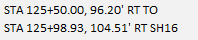

# Pulling Quantities
{: .no_toc }

## Table of contents
{: .no_toc .text-delta }

1. TOC
{:toc}

---

After you've set up the [quantities spreadsheet] for your project, completed all your [design] work, and [added bubble call outs] to your plan sheets, you're ready to start pulling quantities. Quantities refers to the number of BMPs on a given plan sheet, as well as for the whole project. 

Enter the bid item quantities in the columns that correspond to the Plan Sheet stations. All your bid items should fit within the stations for the corresponding sheet; bid items shouldn't overflow into other sheets. This helps us get correct quantity measurements for each sheet.

## Finding and entering quantities
***

1. Open both the Design file and the quantities spreadsheet.
2. Identify the correct sheet cut in the Design file and the corresponding Excel sheet columns.
    - For example, if your sheet cuts are from station 460.5 to 472.5, find the Excel columns labelled `460+50.00 TO 472+50.00` on the Design Quantities tab in the spreadsheet.
3. Find the unit measurement for the BMP you're measuring by using the Element Selection tool in ORD to highlight the BMP the identifying the unit in the Properties pane.
    - Wattle measurements are length (feet), seeding shapes are area (square feet), and inlet protection is a count (usually just 1).
4. Enter the unit measurement in the Excel file.
3. In the Design file, select the **Analyze Point** tool.
4. Click on the [alignment line] you want to measure off of.
    - When choosing alignments, consider which alignment is closest to the BMP and wether the start and end of the BMP follows the entire length of the alignment (for wattles and seeding shapes).
5.  Place a tentative snap on the BMP you want to measure.
    - Wattles and seeding shapes should be measured end to end, while inlet protection will only have a single stationing measurement.
    - You may find it helpful to create a [keyboard shortcut] for Tentative Snaps. This will let you "snap" to your BMP measurement point and keep it there (otherwise the point will move with your cursor). Use the following shortcut label and key-in:

        
        {: .ml-5 }

6. Record the station and offset from the Analyze Point Parameters pane:

    
    {: .ml-2 }

7. If measuring wattles or seeding shapes, do the same for the end of the BMP.

8. Enter the first measurements in the cell next to the corresponding unit measurement and the second measurement in the cell below the first. The correct format is:

    
    {: .ml-2 }

    - If the offset is a negative number in ORD, the offset will be LT (left of the road's centerline)
    - If the offset is a positive number in ORD, the offset will be RT (right of the road's centerline)

9. For seeding shapes, enter the area under a SHAPE cell at the bottom of the column in Excel.

    - The ACRE and CY fields should populate automatically throughout the Station column.
    - You'll only need to enter the station and offset measurements once in the Topsoil (6") section; the measurements should auto-populate throughout the rest of the column sections.

## Next Steps
***

After you've completely filled out the Excel spreadsheet with the BMP quantities, you're ready to [add the quantities] to the Plan Sheets.

[alignment line]: /knowledge-base/docs/glossary#alignment-line
[quantities spreadsheet]: /knowledge-base/docs/quantities_spreadsheet
[design]: /knowledge-base/docs/design-in-ord
[added bubble call outs]: /knowledge-base/docs/annotating-plan-sheets#adding-bubble-call-outs
[keyboard shortcut]: /knowledge-base/docs/ord-tips.html#creating-keyboard-shortcuts
[add the quantities]: /knowledge-base/docs/annotating-plan-sheets.html