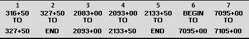
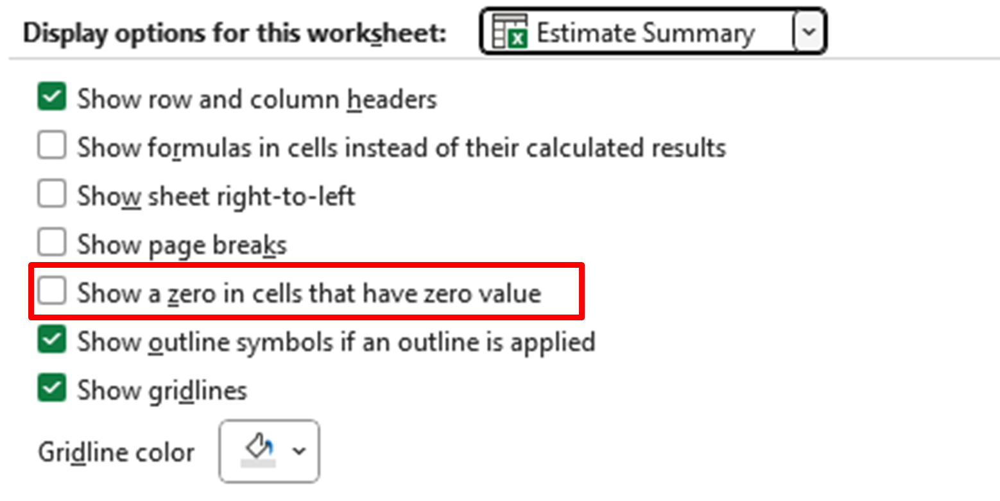
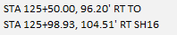

# Quantities Spreadsheet Setup
{: .no_toc }

## Table of contents
{: .no_toc .text-delta }

1. TOC
{:toc}

---

Follow these instructions to set up the Quantities spreadsheet in Excel. The Quantities spreadsheet is used to tabulate the quantities of each bid item needed for a project. Each column in the spreadsheet represents the stationing from a given sheet. The bid items in each column represent the quantity of those items in each plan sheet.

## Copy the Quantities Template
***

Rather than start from scratch, it's easier to copy the existing Quantities Template from the S&C Knowledge Library. That way, you don't
have to worry about reproducing the formulas in the new spreadsheet. The template is located in the `Templates` folder. Alternatively, the template also exists in the `PROJECT FILE (copy for each project)`, so if you've already copied over a new project file, you should be all set.

Once you've copied the template:

1.  In Dropbox, go to **Project Development** > **Design** > **Estimates**

2.  Paste the copied spreadsheet in the Estimates folder

3.  The file should be called `XXXX_Quantities and Estimates_SWPPP_MMDDYYYY`

    -   Replace the `XXXX` with the project name and `MMDDYYYY` with the date

## Prepare the Quantities Template
***

Before you begin, you'll want to set the template up for your project.

1.  Update the stationing for each sheet in the Estimate Summary tab:

    
    {: .ml-2 }

    -   You can confirm the station numbers in the sheet file's border in ORD.

    -   Except for the first station (cell E7), the start station will automatically update based on the end station from the previous column. Overwrite it if necessary (for example, for BEGIN or END stations).

    -   To prevent the NAME values from incrementing up (e.g., SH75, SH76, SH77), hold the **CTRL** key while you drag.

2.  The **Design Quantities** stations should automatically update based on the **Estimate Summary** values.

3.  Update the NAME and KEY NO. for the project in the **Cost Estimate Summary** sheet.

4.  Add any additional bid items not on the template to both the **Design Quantities** and **Estimate Summary** sheets.

    -   Make sure the **Estimate Summary** Total column includes a SUM() function for the new bid item row.

5.  Verify the units for each bid items.

    -   Feet (FT), Cubic Yards (CY), Acres (ACRE), etc.

    -   Check the ITD Pay_Items_Working_Document (Dropbox\\Engineering Reference Docs\\ITD\\ITD Pay Item List\\Pay_Items_Working_Document) to confirm units, check with Sherri for help calculating them.

6.  Make sure that **File** > **Options** > **Advanced** > **Display Options for this Worksheet: "Estimate Summary"** > **Show a zero in cells that have zero value** is unchecked.

    -   With this setting off, empty cells will remain empty instead of displaying a 0.

    

## Populate the Quantities Template
***

Once you've completed the design phase of your project (entered seeding, wattle, inlet protection, etc., into the design file), you can start entering the quantities into the Design Quantities sheet.

Enter the bid item quantities in the columns that correspond to the Plan Sheet stations. All your bid items should fit within the stations for the corresponding sheet; bid items shouldn't overflow into other sheets. This helps us get correct quantity measurements for each sheet.

**For non-seeding items:**

1.  Select the item with the Element Selection tool in ORD to see the item's length in the Properties dialog.

    -   Some items don't have length measurements, such as inlet protection.

2.  Enter the measurement in the left-hand column of the corresponding station section in the Design Quantities sheet.

3.  Use the Analyze Point tool in ORD to check an item's stationing and offset measurements.

    -   Some items, like inlet protection, only have one station.

4.  Record each station and offset measurement and enter them into the Design Quantities sheet.

    -   The correct format for stations and offsets looks like:

        
        {: .ml-5 }

    - If the offset is a negative number in ORD, the offset will be LT (left of the road's centerline)
    - If the offset is a positive number in ORD, the offset will be RT (right of the road's centerline)

**For seeding shapes:**

1.  Select the seed shape with the Element Selection tool in ORD to see the shape's area in the Properties dialog.

2.  Enter the area measurement under a SHAPE cell at the bottom of the column.

    -   The ACRE and CY fields should populate automatically throughout
        the Station column.

3.  Use the Analyze Point tool in ORD to check an item's stationing and offset measurements.

    -   Follow the same station and offset format as above.

    -   You'll only need to enter the station and offset measurements once in the Topsoil (6") section; the measurements should auto-populate throughout the rest of the column sections.
