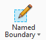
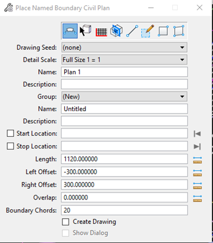
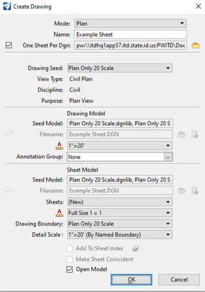

# Plan Sheet Creation
{: .no_toc }

## Table of contents
{: .no_toc .text-delta }

1. TOC
{:toc}

---

This page will guide you through the full workflow for creating plan sheets in OpenRoads Designer Connect Edition.

{: .alert}
It's much simpler (and preferred) to create plan sheets following the instructions on the [Sheet Setup] page.

## Set up your Container File
***

1.  Copy the project 2D Design seed file to the S&C Plan Sheet folder in ProjectWise

2.  Rename the file to include "cf" ("container file"), something like `20788_SnC_cf_swpp_S01.dgn`

3.  Open the file.

4.  Attach the reference files you want displayed in the sheets.

    a.  Usually Alignment, Terrain, ROW, Topo 

## Drawing production process
***

1.  In ORD, navigate to **Drawing Production** > **Named Boundary**

    
    {: .ml-5 }

2.  Click the drop-down arrow.

3.  Click **Place Named Boundary**.

    -   The Place Named Boundary dialog window will display

4.  Select the type of profile you want to create.

    -   Generally for plan sheets, you will select **Civil Plan**. This creates sheets based on the project alignment.

    
    {: .ml-5 }

5.  Select your Drawing Seed based off the desired sheet scale. This can sometimes be a trial-and-error thing. 

    
    {: .ml-2 }

6.  The Detail Scale, Left Offset, Right Offset, and Length will be automatically defined based on your seed selection.

7.  Follow the prompts at the bottom left of the screen. 

8.  Follow the [command view] in the bottom left side of the screen to select **Path Element (Alignment)** and the start and stop location of the sheet cuts. 

9.  Check **Create Drawing** and **Show Dialog**.

10. The Create Drawing dialog window will display.

    
    {: .ml-2 }

11. Name the sheet accordingly. (How do you pick a name accordingly?)

12. Check **One Sheet Per Dgn**.

13. Choose where to save the sheet.

14. Check that the remaining settings are correct.

    -   The settings should be pre-populated by the drawing seed.

15. Click **OK**.

16. Sheets will be created

    -   Sheet files have a drawing model and a sheet model. Toggle between the two by changing the [view toggles] in the lower left of your screen.

17. Annotate sheets as needed in the Sheet Model (white background) of the sheet file. 

{: .note}
To access, manage, or reprint the named boundaries you have created, search *Named Boundaries* in the search bar, located in the upper right-hand corner of the screen. 

[Sheet Setup]: /docs/sheet-setup
[command view]: https://docs.bentley.com/LiveContent/web/OpenRoads%20Designer%20CONNECT%20Edition-v13/en/GUID-40CF9525-AB56-47BF-AF51-63D75333BB61.html
[view toggles]: https://docs.bentley.com/LiveContent/web/OpenRoads%20Designer%20CONNECT%20Edition-v13/en/GUID-40CF9525-AB56-47BF-AF51-63D75333BB61.html