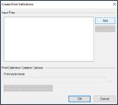
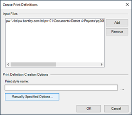

# Creating a Print Set (PSET) for Plan Sheets
{: .no_toc }

## Table of contents
{: .no_toc .text-delta }

1. TOC
{:toc}

---

You'll need to create a print set (also known as a pset) to "print" your plan sheets to PDF.

These steps will guide you through creating a Print Set (.pset) of
sheets in ORD.

## Copy & Rename the 2D Seed file
1.  Find the project 2D seed file, right click, then click **Copy**.
    Paste it into the S&C sheet folder for the project.

    -   The 2d seed file is usually located in the **Project Development** > **Project Resources** > **OpenRoads Designer** > **Project Seeds** directory. It'll be named something like `xxxxx_Seed2d.dgn`

2.  Rename the seed file using this naming convention: 
    `12345_Discipline_Date.PSET`

    -   E.g., `20445_Util_03102022.pset`

## Set up the Print Organizer

1.  Open the .pset file

2.  Go to **File** > **Print** > **Print Organizer**

    -   **Alternative option:** Open one of the plan sheets from your project, then select **File** > **Print** > **Print Organizer**. Follow the steps below.

    

3.  Select **Add Files to Set**.

    

4.  Select **Add**.

    

5.  Add all the files you want included in the pset.

## Set the Print Definitions

{: .alert}
This step is important, go slow and check that you made the right selections.

1. Select **Manually Specified Options**, not **"..."**

2.  For Utility Sheets, use the Utility Pen Table. See the below settings for the recommended selection.

    -   Utility Sheets:

        -   Pen Table=ITD.tbl

        -   Design Script=Halfsize Utility

    -   SWPPP Sheets:

        -   Pen Table=ITD.tbl

        -   Design Script= Automatic Size and Color

    

    
        
3. Set the Logical name in the container file. See the screen shot below for the Logical names that the automatic size and color can read. Note that each logical name needs to be unique. So if you need multiple files to print in Black and White, Type BW-1, BW-2 Etc. Logical names can be manipulate in the references dialog in the container file.

    

4. Click **OK**, then click **OK** again

5. Print

    -   When the pset is done and asks if you want to save, select
        **Yes**, then **No Wizard**. Update the pset file name and make
        sure it's saving to your current S&C Plan Sheet folder location.

**Automatic Size and Color Design Script recognizes the following logical names:**

|Code | Color Name |
| --- | --- |
|BW | Black and White |
|DG | Dark Grey |
|MG | Medium Grey |
|LG | Light Grey |
|VL | Very Light Grey |
|Color | Color |

Adjust these in **References** > **Logical**

-   If Logical is not an option, right click in the top bar where it
    says file name. Check **Logical**.

