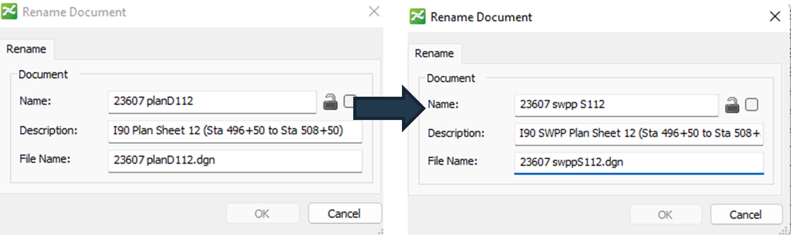
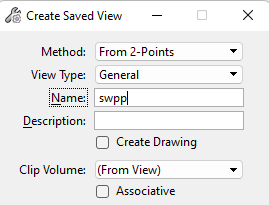

# Sheet Setup
{: .no_toc }

## Table of contents
{: .no_toc .text-delta }

1. TOC
{:toc}

---

This document will guide you through how to set up plan sheets for a project.

## Update the Plan Sheet File Name in ProjectWise
***
1.  In ProjectWise, right click on the file, then select **Rename** to rename the sheet file.

-   Change the name to include swpp and add an "S" to the start of the sheet number.

-   Add swpp to the description somewhere.

-   Add swpp and "S" to the file name.

    
    {: .ml-5 }

## Update the References in ORD
***
1.  Open the renamed file in ORD.

2.  In the References dialog box, double click each reference, then select **Browse** from the pop-up.

3.  Direct the path to the appropriate S&C Sheet Plan file.

    -   If the old reference file is still in the References dialog box, detach it.

4.  Detach the kmap file by right clicking the file, then selecting **Detach.**

## Clip the Boundary to fit in the Border File
***

1.  Clip the boundary of the Container file by right clicking the Container reference, then selecting **Clip Boundary**. Select the green dashed boundary within the border to clip.

2.  Delete the extraneous text in the sheet.

    -   Keep the match lines, centerline call outs, and road names.

3.  Change the sheet title in the border to **SWPP PLAN SHEET**.

    -   Alternatively, if there's an overlap between the old name and the new, delete the old name.

## Create a Saved View
***
1.  Create a saved view.

    -   Click **Drawing Production** > **Saved View** > **Create Saved View**

2. In the Create Saved View dialog box, change the Method to **From 2-Points**, change the name to **swpp**, then click the top left-hand corner and bottom right-hand corner of the border.

    - You can also use the key-in `namedview create 1 SWPP` 

    
    {: .ml-5 }

11. Click **X** to close the file.

12. Click **Check In** to save your changes.

{: .alert }
Be sure to only check in the SWPP file you're working on. Sometimes, you may find that the reference files have been checked out. Be sure to Free any files that don't belong to S&C. 
