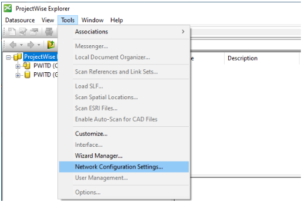
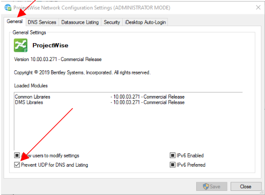
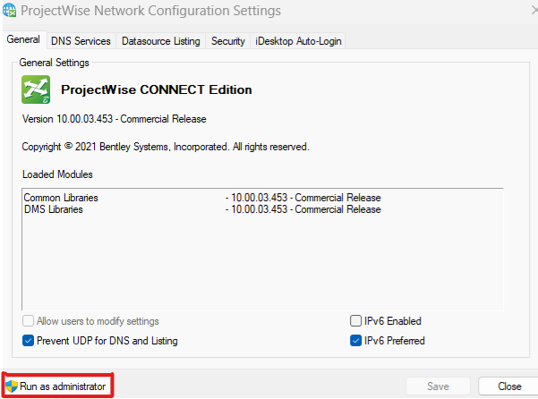
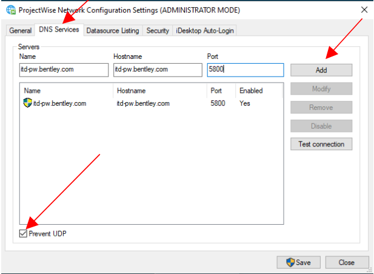
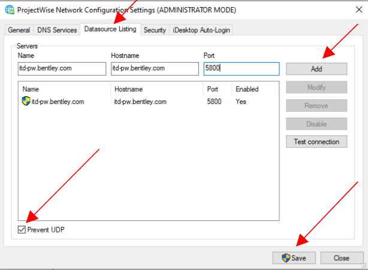
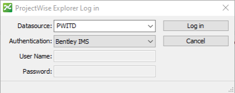

# Software Downloads
{: .no_toc }

## Table of contents
{: .no_toc .text-delta }

1. TOC
{:toc}

---
Once you have your workstation, you'll need to download the required software. Follow the instructions on this page to get everything you need.

{: .note }
For software licenses that require purchasing, ask your supervisor for the corporate credit card information.

## Company Email
***
Your email account is set up with no action on your part necessary. You can access your email via the Outlook icon in the Windows taskbar. 
- Open Outlook
- Email: xxxxx, password: xxxxx
- Set up an [email signature]. 
- Copy the logo from the S&C Style Guide reference doc in Dropbox.
- To change email password go to [myaccount.microsoft.com].
- Navigate to **Password**, then enter your old and new passwords.

## Bluebeam
***
- Go to [store.bluebeam.com]
- Select **Core** ($300)
  - You'll need a new account, be sure to use your S&C email address
   
## Dropbox
***
- To download the Dropbox desktop app, [click here]
  - Once you've downloaded and set up your Dropbox account, contact your supervisor to be given access to the necessary folders for your work assignments
-  Select **Dropbox Plus – 2,000 GB storage space** ($9.99/ month, billed annually) as your plan

## Zoom (free tier)
***
- Go to [Zoom Downloads]

## HP Printer Driver
***
- Go to [HP Downloads]

## Connection Client from Bentley 
***
- Go to [Bentley Software]

## OpenRoads Designer
***
OpenRoads Designer is billed quarterly based on the number of licenses used. You won't need to pay but confirm with your supervisor that you've been granted access. 
1. Open ConnectionClient
2. Click **CONNECT Center**
3. On connect.bentley.com, scroll down, then click **Software Downloads**
4. Click **Get Software** for OpenRoads Designer
    - Contact your supervisor if you get the following message: "You do not have access to Software Downloads Application."

## ProjectWise Explorer Client Download
***
{: .note }
This will require special permissions from ITD and S&C. Like OpenRoads Designer, you won’t need to pay, but you’ll need to confirm with your supervisor that you’ve been granted access.

1. Go to [Bentley Software Downloads]
2. Click **Get Software** for ProjectWise Explorer Client
3. Request Login information from ITD
4. Add [ITD's ProjectWise Datasource] to ProjectWise Explorer

If you're unable to login with the provided password, you may need to input your Bentley site activation key:

1. In the Windows File Explorer, navigate to the ~ActivationWizard~
  - The easiest way to do this is to go C:\Program Files, then search "ActivationWizard"
2. Open the ActivationWizard, select **Next**, then complete the server information:
  - Server Name: selectserver.bentley.com
  - Site Activation Key: [REQUEST FROM SUPERVISOR]
3. Select your country as United States > Skip License Checkout > Finish

## Activating ITD's ProjectWise Datasource Gateway
***
You'll need ITD login credentials to access ITD's ProjectWise files. Contact your supervisor to request access.

Then, follow their instructions for logging in:

1. In ProjectWise, got to **Tools** > **Network Configuration Settings**.

    
    {: .ml-2 }

2. Under the *General* tab, check **Prevent UDP for DNS and Listening**.

    
    {: .ml-2 }

3. Click **Run as Administrator**.

    
    {: .ml-2 }

4. Click the *DNS Services* tab, check **Prevent UDP**

5. Fill in the Name and Hostname fields with **itd-pw.bentley.com**

6. Fill in the Port field with **5800**.

    
    {: .ml-2 }

7. Repeat steps 4 and 5 on the *Datasource Listening* tab.

    
    {: .ml-2 }

8. Click **Save**.

9. Close and re-open ProjectWise. You should see PWITD's datasource.

10. Double-click on the PWITD datasource.

11. You'll be prompted to log in. 

  - Select **PWITD** in the Datasource field.

  - Select **Bentley IMS** for your Authentication.

    
    {: .ml-5 }

  - Click **Log in** or **Activate**, depending on which ProjectWise version you're using.

  - If you're not signed in, you'll be prompted to at this time. Use your ITD login credentials to log in.

## Activating HDR's ProjectWise Datasource Gateway
***
YOu'll need HDR login credentials to access HDR's ProjectWise files. Contact your supervisor to request access.

Then, follow their instructions:

- [HDR's ProjectWise Datasource]

## Changing your ITD Password
***

1. Open ProjectWise Explorer
2. Go to **Tools**
3. Select **Options**
4. Enter the ITD-supplied password in **Old Password**
5. Enter your new password in **New Password** and **Verify New Password**
6. Click **Ok**

---
[myaccount.microsoft.com]: https://myaccount.microsoft.com/
[store.bluebeam.com]: https://store.bluebeam.com/
[click here]: https://www.dropbox.com/downloading
[Zoom Downloads]: https://zoom.us/support/download
[HP Downloads]: https://support.hp.com/us-en/drivers/selfservice/hp-laserjet-5200-printer-series/1137934
[Bentley Software]: https://www.bentley.com/software/connection-client/
[email signature]: https://support.microsoft.com/en-us/office/create-and-add-an-email-signature-in-outlook-5ff9dcfd-d3f1-447b-b2e9-39f91b074ea3#ID0EBDD=New_Outlook
[Bentley Software Downloads]: https://softwaredownloads.bentley.com/
[ITD's ProjectWise Datasource]: https://itd.idaho.gov/wp-content/uploads/2020/04/ProjectWise_Gateway_Instructions.pdf
[HDR's ProjectWise Datasource]: https://projectwise.hdrinc.com/assets/projectwise/pw-install-instructions-hdr-external-users.pdf

